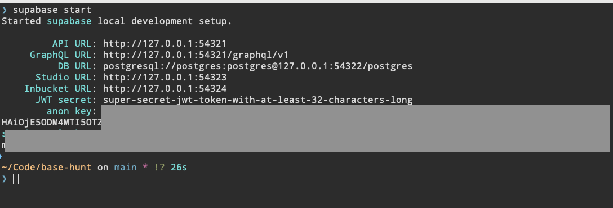

Basehunt Dapp

## TODOs: Argentina

### ENV
- [ ] Make sure everyone can configure + build Locally
  - [X] Amhed
  - [ ] Farid
  - [ ] Mike
- [X] Create supabase instance
  - [X] Run first schema script (migration?)
- [X] Create Vercel instance
  - [ ] Update Vercel ENV variables
- [ ] Configure vercel.json
- [ ] Configure Prisma / CLI should allow performing migrations

### Basehunt Actions
- [ ] Define final list of features
- [ ] Change Branding (not Basehunt). Who's the correct DRI?
- [ ] Remove Guilds, not applicable to this first version
- [ ] Generate QR from Linkdrop that can both onboard a user and drop an NFT so they start counting towards basehunt points 

## Getting Started

1. Configure Supabase

Install CLI
```sh
brew install supabase/tap/supabase
```

And then link to the correct instance
```sh
supabase link
```

2. Install npm dependencies

```sh
yarn install
```

3. Install Docker Desktop (https://www.docker.com/products/docker-desktop/)

4. Configure your local supabase instance

This should download any necessary containers and configure a local database and dashboard for Supabase services
```sh
supabase start
```



5. Update ENV file. use `.env.sample.local` as starting point

6. Download and run the latest migration from the server

```sh
supabase db reset
```